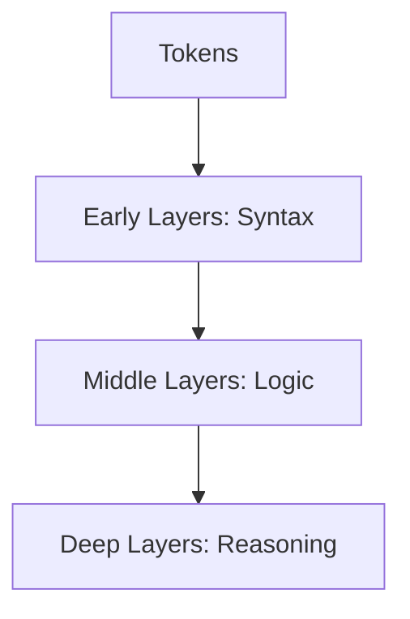
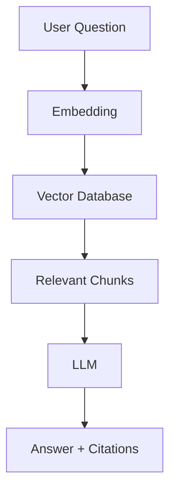

# Understanding LLMs, RAG, and Secure Document Q&A

## Purpose
This document summarizes core concepts around Large Language Models (LLMs), Retrieval-Augmented Generation (RAG),
data safety, and enterprise usage patterns.

---

## What is an LLM?
An LLM is a neural network trained to predict the next token in a sequence.
It does not store documents or remember past requests.
It understands patterns of language, code, and reasoning.

---

## Why LLMs Can Write Code
LLMs learn syntax and programming patterns from large-scale training data.
They do not store programs but can generate code from requirements.

---

## Layers & Attention
- Tokens are the basic units of input
- Attention decides which tokens matter
- Layers progressively refine understanding

### Mermaid Diagram: LLM Layers

---

## What is RAG?
RAG combines:
- External knowledge (documents)
- Vector search (retrieval)
- LLMs (generation)

### Mermaid Diagram: RAG Flow

---

## Role Separation
Documents contain facts.
Vectors locate facts.
LLMs explain facts.

---

## RAG vs Fine-Tuning
RAG keeps knowledge external, updatable, and auditable.
Fine-tuning bakes knowledge into model weights and is risky for enterprises.

---

## Safety & Statelessness
LLM API calls are stateless.
Even over time, models do not accumulate or remember your documents.

---

## Appendix: Build Your Own Minimal RAG

Steps:
1. Load documents (PDF, DOCX)
2. Chunk text (200-500 words)
3. Create embeddings
4. Store embeddings in vector DB (FAISS/Chroma)
5. On query:
   - Embed question
   - Retrieve top-k chunks
   - Send chunks + question to LLM
6. Return answer with citations

---

## FAQ
**Does the LLM store my data?**
No.

**Does RAG send data to the LLM?**
Yes, but only minimal relevant text.

**Why is RAG enterprise-safe?**
Because of data minimization, statelessness, and auditability.
